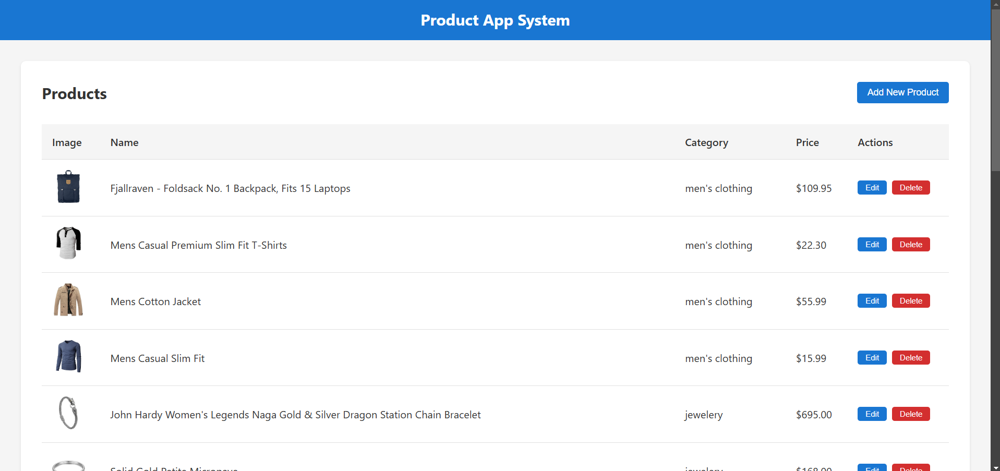
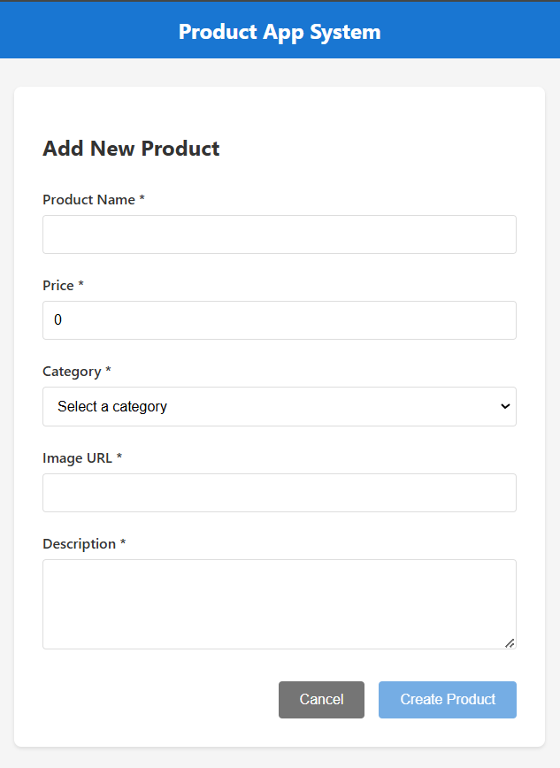
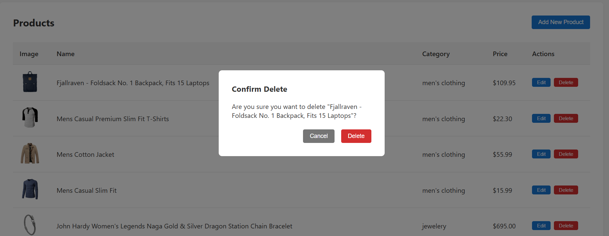

# Product App System - Angular 20

Una aplicación de gestión de productos construida con Angular 20, utilizando signals.

## Características

- **Listado de productos** con tabla responsiva
- **Creación de productos** con formulario validado
- **Edición de productos** con datos pre-cargados
- **Eliminación de productos** con confirmación
- **Estado de carga** con indicadores visuales
- **Manejo de errores** robusto
- **Arquitectura moderna** con signals

## Tecnologías Utilizadas

- **Angular 20** - Framework principal
- **Signals** - Para gestión de estado reactivo
- **Standalone Components** - Componentes independientes
- **Reactive Forms** - Formularios reactivos con validación
- **RxJS** - Programación reactiva
- **Fake Store API** - API REST pública

## Requisitos Previos

- Node.js (v20 o superior)
- npm (v10 o superior)
- Angular CLI (v20)

## Instalación

1. Clonar el repositorio:
```bash
git clone https://github.com/HiginioSosa/product-app-angular-higinio-sosa.git
cd product-app-angular-higinio-sosa
```

2. Instalar dependencias:
```bash
npm install
```

3. Ejecutar la aplicación:
```bash
ng serve
```

4. Abrir en el navegador:
```
http://localhost:4200
```

## Estructura del Proyecto

```
src/
├── app/
│   ├── components/
│   │   ├── product-list/
│   │   │   └── product-list.component.ts
│   │   └── product-form/
│   │       └── product-form.component.ts
│   ├── models/
│   │   └── product.model.ts
│   ├── services/
│   │   └── product.service.ts
│   ├── app.component.ts
│   ├── app.routes.ts
│   └── main.ts
├── assets/
└── styles.scss
```

## API Utilizada

**Fake Store API**: https://fakestoreapi.com

### Endpoints principales:
- `GET /products` - Obtener todos los productos
- `GET /products/{id}` - Obtener un producto específico
- `POST /products` - Crear un nuevo producto
- `PUT /products/{id}` - Actualizar un producto
- `DELETE /products/{id}` - Eliminar un producto

*Nota: Las operaciones POST, PUT y DELETE no persisten cambios reales en el servidor, pero la API responde como si lo hiciera.*

## Funcionalidades Implementadas

### Listado de Productos
- Tabla con imagen, nombre, categoría, precio y acciones
- Indicador de carga mientras se obtienen los datos
- Manejo de errores con opción de reintentar
- Estado vacío cuando no hay productos

### Formulario de Productos
- Validación en tiempo real de todos los campos
- Preview de imagen al ingresar URL válida
- Modo de creación y edición
- Mensajes de éxito/error
- Navegación automática al guardar

### Eliminación de Productos
- Modal de confirmación antes de eliminar
- Actualización inmediata de la lista
- Manejo de errores

## Arquitectura y Mejores Prácticas

### Signals y Estado Reactivo
- Uso de signals para gestión de estado local
- Computed signals para valores derivados
- Estado inmutable con métodos update()

### Separación de Responsabilidades
- **Componentes**: Solo lógica de presentación
- **Servicios**: Lógica de negocio y comunicación HTTP
- **Modelos**: Interfaces y tipos TypeScript

### Manejo de Errores
- Interceptación de errores HTTP
- Mensajes de error descriptivos
- Estados de error en la UI

## Capturas de Pantalla

### Lista de Productos


### Formulario de Producto


### Modal de Confirmación


## Despliegue

### GitHub Pages
```bash
ng build --base-href /product-app-angular-[tu-nombre]/
npx angular-cli-ghpages --dir=dist/product-app-angular-[tu-nombre]/browser
```

## Licencia

Este proyecto está bajo la licencia MIT. Ver el archivo [LICENSE](LICENSE) para más detalles.

## Autor

**José Higinio Sosa Vázquez**

- GitHub: [@HiginioSosa](https://github.com/HiginioSosa)

---

# Decisiones Técnicas - Product App System

## 1. Angular 20 con Signals

### Decisión
Utilizar la versión más reciente de Angular (v20) con el nuevo sistema de signals para la gestión de estado.

### Justificación
- **Performance**: Los signals ofrecen mejor rendimiento que los observables tradicionales para estado local
- **Simplicidad**: Sintaxis más simple y directa para manejar estado reactivo
- **Futuro**: Angular está moviendo su ecosistema hacia signals como el estándar

## 2. Standalone Components

### Decisión
Usar componentes standalone sin módulos NgModule.

### Justificación
- **Simplicidad**: Menos boilerplate
- **Tree-shaking**: Mejor optimización del bundle
- **Lazy Loading**: Más granular y eficiente

## 3. Arquitectura de Estado Local

### Decisión
Mantener el estado en un servicio singleton con signals en lugar de usar NgRx o Akita.

### Justificación
- **Simplicidad**: Para una aplicación CRUD simple, no se necesita la complejidad de un store global
- **Performance**: Los signals son suficientes para este caso de uso
- **Mantenibilidad**: Menos código y conceptos para entender

### Estructura
```
ProductService
├── Estado (signals privados)
├── Selectores (signals computados públicos)
└── Acciones (métodos que actualizan el estado)
```

## 4. Manejo de Errores

### Decisión
Implementar manejo de errores a nivel de servicio con estados visuales en componentes.

### Justificación
- **UX**: Los usuarios siempre saben qué está pasando
- **Debugging**: Errores logeados para desarrollo
- **Recuperación**: Opciones para reintentar operaciones fallidas

## 5. Formularios Reactivos

### Decisión
Usar Reactive Forms en lugar de Template-driven Forms.

### Justificación
- **Type Safety**: Mejor tipado con TypeScript
- **Validación**: Validadores más robustos y reutilizables

## 6. Lazy Loading de Rutas

### Decisión
Implementar lazy loading para todos los componentes de ruta.

### Justificación
- **Performance**: Carga inicial más rápida
- **Escalabilidad**: Preparado para crecer
- **Code Splitting**: Bundles más pequeños

## 7. HTTP Client Directo

### Decisión
Usar HttpClient directamente sin interceptores complejos.

### Justificación
- **Simplicidad**: La API no requiere autenticación
- **Claridad**: El flujo de datos es más transparente
- **Suficiente**: Para los requisitos actuales es adecuado

## Conclusiones

Estas decisiones técnicas buscan equilibrar:
- **Modernidad**: Usar las últimas características de Angular
- **Simplicidad**: No sobre-engineerear la solución
- **Performance**: Optimizar donde importa
- **Mantenibilidad**: Código claro y bien estructurado
